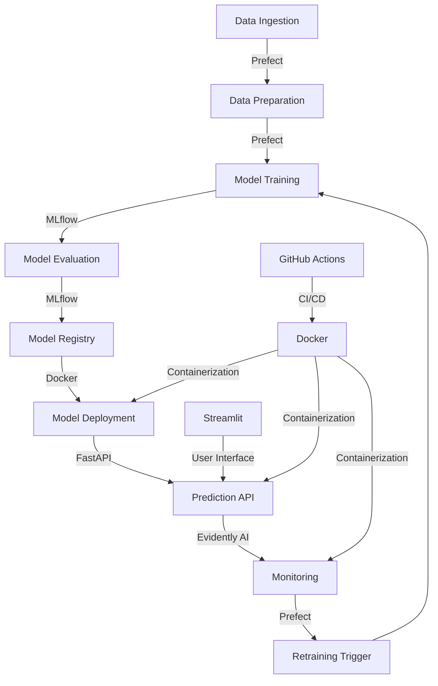

# Earthquake Prediction System MLOps Project for DataTalkClub

This project aims to predict earthquake magnitudes using machine learning techniques, implemented with MLOps best practices. It's designed to meet the requirements of the MLOps Zoomcamp course project.

## System Architecture



## Project Requirements Fulfillment

1. **Problem Description**: This project predicts earthquake magnitudes and depths, which is crucial for disaster preparedness and risk assessment.

2. **Cloud**: While primarily developed locally, the project uses Docker, making it cloud-ready and deployable to container management platforms like Kubernetes.

3. **Experiment Tracking and Model Registry**: MLflow is used for tracking experiments and registering models.

4. **Workflow Orchestration**: Prefect orchestrates the data preparation and model training pipelines.

5. **Model Deployment**: The model is containerized using Docker and served via a FastAPI endpoint.

6. **Model Monitoring**: Evidently AI is used for model monitoring and data drift detection.

7. **Reproducibility**: Docker ensures reproducibility across different environments.

8. **Best Practices**:
   - Unit tests are implemented
   - Integration tests are implemented
   - Linter (flake8) and formatter (Black) are used
   - Makefile is provided for common operations
   - Pre-commit hooks are set up
   - CI/CD pipeline is implemented using GitHub Actions

## Data Source

This project uses the "All the Earthquakes Dataset: from 1990-2023" available on [Kaggle](https://www.kaggle.com/datasets/alessandrolobello/the-ultimate-earthquake-dataset-from-1990-2023).

## Technologies Used

- **FastAPI**: For creating the prediction API
- **Streamlit**: For the user interface and monitoring dashboard
- **MLflow**: For experiment tracking and model registry
- **Prefect**: For workflow orchestration
- **Evidently AI**: For model monitoring and data drift detection
- **Docker**: For containerization
- **GitHub Actions**: For CI/CD pipeline
- **Pytest**: For unit and integration testing
- **Flake8**: For linting
- **Black**: For code formatting
- **Make**: For simplifying common operations

## Setup and Installation

### Prerequisites
- Docker and Docker Compose
- Git
- Make (optional, for using Makefile commands)

### Step-by-step Guide

1. Clone the repository:
   ```
   git clone <repository-url>
   cd earthquake_prediction
   ```

2. Create necessary directories:
   ```
   mkdir -p data/raw data/processed models static
   ```

3. Download the dataset from Kaggle and place it in `data/raw/Earthquakes-1990-2023.csv`

4. Build and start the Docker containers:
   ```
   docker-compose up --build
   ```

5. Access the different components:
   - Streamlit UI: http://localhost:8501
   - FastAPI Documentation: http://localhost:8000/docs
   - MLflow UI: http://localhost:5000
   - Prefect UI: http://localhost:4200

## Usage

### Data Preparation

We apologize for the manual data download process. Due to time constraints, we couldn't implement an automated solution for handling large files with GitHub. We appreciate your understanding.

To prepare the data:

1. Manually download the dataset:
   - Go to [Kaggle](https://www.kaggle.com/datasets/alessandrolobello/the-ultimate-earthquake-dataset-from-1990-2023)
   - Download the "Earthquakes-1990-2023.csv" file
   - Place the downloaded file in the `data/raw/` directory of this project

2. Verify the file location:
   ```
   ls data/raw/Earthquakes-1990-2023.csv
   ```
   If you see the file listed, it's in the correct location.

3. Run the data preparation pipeline:
   ```
   docker-compose run --rm prefect python src/data_prep.py
   ```
   This will process the raw data and save the result in `data/processed/earthquake_data.csv`

Note: In a production environment, we would implement a more automated solution for data retrieval and version control of large files. Potential improvements could include using tools like DVC (Data Version Control) or implementing a data download script that uses the Kaggle API.

### Model Training

After preparing the data, you can train the earthquake prediction model:

1. Ensure you have completed the data preparation step.
2. Run the training pipeline:
   ```
   docker-compose run --rm prefect python src/train_magnitude_model.py
   ```
   This command will:
   - Load the processed data
   - Split the data into training and validation sets
   - Train models for magnitude and depth prediction using CatBoost
   - Log the training process and results to MLflow
   - Save the trained models in the `models/` directory

3. The training process may take some time depending on your hardware. You'll see progress bars and log messages in the console.

### Viewing Experiments in MLflow

MLflow allows you to track and compare different model training runs:

1. Ensure the MLflow server is running:
   ```
   docker-compose up -d mlflow
   ```

2. Open a web browser and go to `http://localhost:5000`

3. In the MLflow UI:
   - The left sidebar shows a list of experiments
   - Click on an experiment to see its runs
   - Each run represents a model training session
   - You can compare metrics, parameters, and artifacts across runs
   - Click on a run to see detailed information, including:
     - Model performance metrics
     - Training parameters
     - Logged artifacts (e.g., feature importance plots)

4. You can use this information to decide which model version to deploy or to guide further experimentation.

### Making Predictions

#### Using the Streamlit UI

1. Ensure the Streamlit app is running (`docker-compose up streamlit`)
2. Open a web browser and go to `http://localhost:8501`
3. Use the interface to input earthquake parameters and get predictions

#### Using the FastAPI Endpoint

1. Ensure the API is running (`docker-compose up api`)
2. You can use curl or any HTTP client to make a POST request to `http://localhost:8000/predict_earthquake`
3. Example using curl:
   ```
   curl -X POST "http://localhost:8000/predict_earthquake" -H "Content-Type: application/json" -d '{"latitude": 35.0, "longitude": -120.0, "date": "2023-08-10T12:00:00"}'
   ```

### Monitoring

Our monitoring system uses Evidently AI for data drift detection and reporting, and the reports are served via the FastAPI application.

To access the monitoring dashboard:

1. Ensure all services are running:
   ```
   docker-compose up
   ```

2. Open a web browser and go to `http://localhost:8000/monitoring`

3. This page, served by FastAPI, displays the Evidently AI dashboard, which includes:
   - Recent predictions
   - Prediction distribution visualizations
   - Data drift results
   - Data drift score over time
   - Drift detection frequency

4. The system automatically checks for data drift when new predictions are made. If enough data is available (at least 200 predictions), it will generate and display an Evidently AI report.

5. The latest Evidently AI data drift report is automatically updated on this page when available.

Note: The monitoring system stores prediction data and drift detection results in a SQLite database (`data/monitoring.db`). This allows for persistence of monitoring data across application restarts.

To generate sample prediction data for monitoring (useful for testing):

1. Ensure the API is running
2. Run the following command:
   ```
   python src/generate_inferred_data_api.py
   ```
   This script will generate a set of sample predictions, which will be logged in the monitoring database and used for drift detection.

Remember that meaningful drift detection requires a sufficient amount of data. If you're not seeing drift reports, it may be because there aren't enough predictions yet.

To make predictions and populate the monitoring data:

1. Use the Streamlit interface at `http://localhost:8501` to make predictions
2. Or use the FastAPI endpoint directly:
   ```
   curl -X POST "http://localhost:8000/predict_earthquake" -H "Content-Type: application/json" -d '{"latitude": 35.0, "longitude": -120.0, "date": "2023-08-10T12:00:00"}'
   ```

Each prediction will be logged and used for monitoring and drift detection.

### Running Tests

To run all tests:

```
make test
```

To run specific test files:

```
docker-compose run --rm prefect pytest tests/test_data_prep.py
docker-compose run --rm prefect pytest tests/test_model_training.py
```

### Linting and Formatting

To lint the code:

```
make lint
```

To format the code:

```
make format
```

### CI/CD Pipeline

The CI/CD pipeline is automatically triggered on push to the main branch. To manually trigger it:

1. Go to the "Actions" tab in your GitHub repository
2. Select the "CI/CD" workflow
3. Click "Run workflow"

This will run tests, linting, and build Docker images.

### Workflow Orchestration with Prefect

To view and manage Prefect flows:

1. Ensure the Prefect server is running (`docker-compose up prefect`)
2. Open a web browser and go to `http://localhost:4200`
3. You can view flows, check their status, and trigger new runs

### Updating Dependencies

If you need to add or update Python dependencies:

1. Update the `Pipfile`
2. Run `pipenv lock` to update `Pipfile.lock`
3. Rebuild the Docker images:
   ```
   docker-compose build
   ```

## Troubleshooting

- If you encounter issues with Docker, try removing all containers and volumes:
  ```
  docker-compose down -v
  ```
  Then rebuild and start the containers:
  ```
  docker-compose up --build
  ```

- If MLflow doesn't show your experiments, check that the `mlruns` directory is being correctly mounted in the Docker container

- For issues with Prefect flows, check the Prefect UI for detailed logs and error messages

## CI/CD

The project uses GitHub Actions for Continuous Integration and Continuous Deployment. The pipeline runs tests, linting, and builds Docker images on each push to the main branch.

## Contributing

See CONTRIBUTING.md for details on submitting pull requests.

## License

This project is under the MIT License. See LICENSE.md for details.
