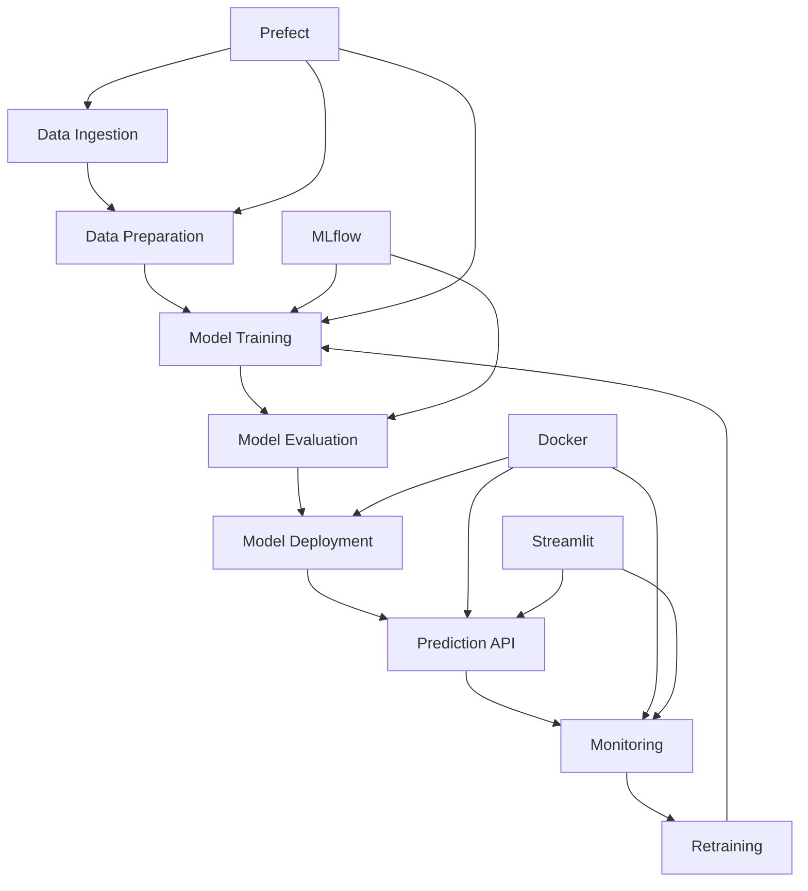

# Earthquake Prediction System

This project aims to predict earthquake magnitudes using machine learning techniques, implemented with MLOps best practices.

## System Architecture



## Data Source

This project uses the "All the Earthquakes Dataset: from 1990-2023" available on Kaggle. You can download the dataset from [here](https://www.kaggle.com/datasets/alessandrolobello/the-ultimate-earthquake-dataset-from-1990-2023).

## Setup and Installation

### Prerequisites
- Docker and Docker Compose
- Git
- Make (optional, for using Makefile commands)

### Step-by-step Guide

1. Clone the repository:
   ```
   git clone <repository-url>
   cd earthquake_prediction
   ```

2. Create necessary directories:
   ```
   mkdir -p data/raw data/processed models static
   ```

3. Download the dataset from Kaggle and place it in `data/raw/Earthquakes-1990-2023.csv`

4. Build and start the Docker containers:
   ```
   docker-compose up --build
   ```

5. Access the different components:
   - Streamlit UI: http://localhost:8501
   - FastAPI Documentation: http://localhost:8000/docs
   - MLflow UI: http://localhost:5000
   - Prefect UI: http://localhost:4200

## Project Structure

- `data/`: Contains raw and processed data
- `src/`: Source code for data processing, model training, and API
- `models/`: Saved model artifacts
- `static/`: Static files for the API
- `tests/`: Unit and integration tests
- `Dockerfile.*`: Dockerfiles for different services
- `docker-compose.yml`: Docker Compose configuration
- `Pipfile` and `Pipfile.lock`: Python dependencies
- `Makefile`: Contains commands for common operations

## Key Components

1. **Data Preparation** (`src/data_prep.py`): Processes raw earthquake data.
2. **Model Training** (`src/train_magnitude_model.py`): Trains the earthquake prediction model.
3. **API** (`src/api.py`): Serves predictions using FastAPI.
4. **Monitoring** (`src/monitoring.py`): Monitors model performance and data drift.
5. **Streamlit App** (`src/streamlit_app.py`): User interface for interacting with the model and viewing predictions.
6. **Monitoring Dashboard** (`src/monitoring_dashboard.py`): Separate Streamlit app for viewing monitoring data and data drift reports.

## MLOps Features

- **Experiment Tracking**: MLflow is used to track experiments and model versions.
- **Workflow Orchestration**: Prefect orchestrates the data preparation and model training pipelines.
- **Containerization**: Docker is used to containerize all components, ensuring consistency across environments.
- **Model Serving**: FastAPI serves the model predictions.
- **Monitoring**: Custom monitoring solution tracks model performance and data drift.
- **CI/CD**: (TODO: Implement CI/CD pipeline)

## Usage

### Running Tests

To run the tests, use the following command:

```
make test
```

This will run all the tests in the `tests/` directory.

### Linting

To run the linter (flake8), use:

```
make lint
```

### Formatting

To format the code using Black, run:

```
make format
```

### Making Predictions

You can make predictions using either the FastAPI endpoint or the Streamlit interface.

### Viewing Monitoring Data

Access the monitoring dashboard by running:

```
streamlit run src/monitoring_dashboard.py
```

This will show model performance metrics, data drift reports, and other relevant monitoring information.

## Contributing

See CONTRIBUTING.md for details on submitting pull requests.

## License

This project is under the MIT License. See LICENSE.md for details.

## Future Development

- Implement CI/CD pipeline
- Enhance model performance with advanced feature engineering
- Expand monitoring capabilities
- Develop automated retraining pipeline